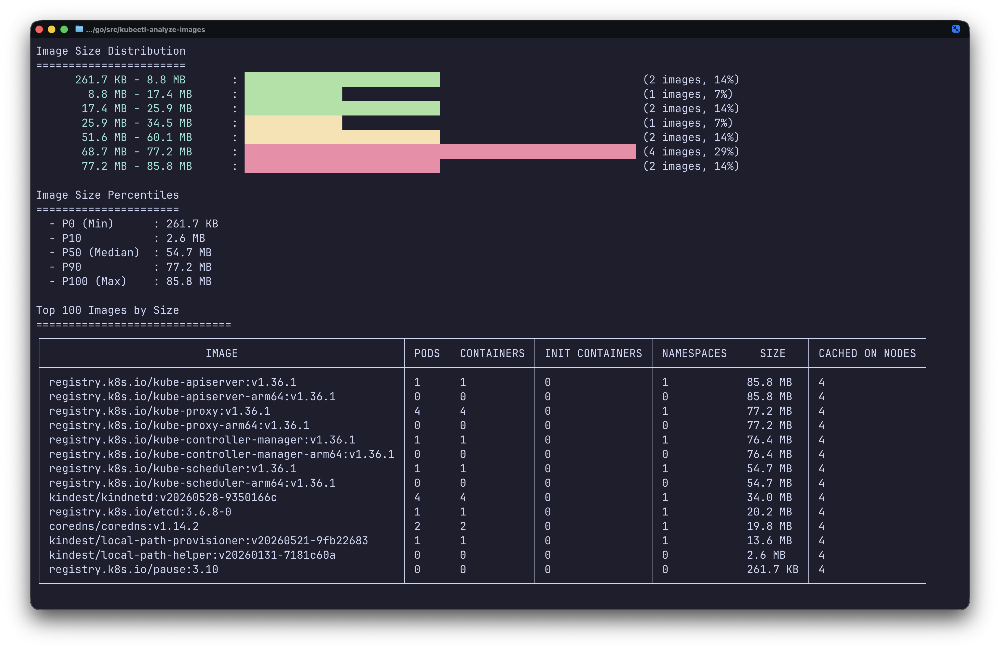

# kubectl-analyze-images



`kubectl analyze-images` shows which container images are present and in use across a Kubernetes cluster. It reports node-local image sizes, pod/container usage, cached-on-node counts, and image size distribution using Kubernetes pod and node status data only -- no registry credentials required.

## Installation

### GitHub releases

Download the latest archive for your platform from the [releases page](https://github.com/ronaknnathani/kubectl-analyze-images/releases), then place the binary on your `PATH`.

```bash
curl -LO https://github.com/ronaknnathani/kubectl-analyze-images/releases/latest/download/kubectl-analyze-images_1.0.0_darwin_arm64.tar.gz
tar xzf kubectl-analyze-images_1.0.0_darwin_arm64.tar.gz
sudo mv kubectl-analyze-images /usr/local/bin/
```

Use the matching archive for Linux, Intel macOS, or Windows from the release assets.

### krew

```bash
kubectl krew install --manifest=plugins/analyze-images.yaml
```

### Source

```bash
git clone https://github.com/ronaknnathani/kubectl-analyze-images.git
cd kubectl-analyze-images
make build
make install
```

Requires Go 1.23+.

## Usage

```bash
kubectl analyze-images
kubectl analyze-images -n production -l app=web
kubectl analyze-images --sort-by=pods --top-images=50
kubectl analyze-images -o json
```

## How it works

The plugin lists pods and nodes with read-only Kubernetes API calls. Pod specs provide usage counts, while node status provides image sizes and cached-on-node counts. For namespace or label-filtered runs, it reports only matching pod images and enriches them with node image data when available.

## Development

```bash
make build          # Build the plugin
make test           # Run tests
make lint           # Run golangci-lint
make check          # Run tests and linter
make test-coverage  # Run tests with coverage report
make snapshot       # Build snapshot release locally
```

## Releasing

```bash
make check
git tag -a v1.1.0 -m "Release v1.1.0"
git push origin v1.1.0
```

GoReleaser publishes release artifacts via GitHub Actions. Update `plugins/analyze-images.yaml` with checksums from the release before distributing via krew.

## License

MIT. See [LICENSE](LICENSE).
